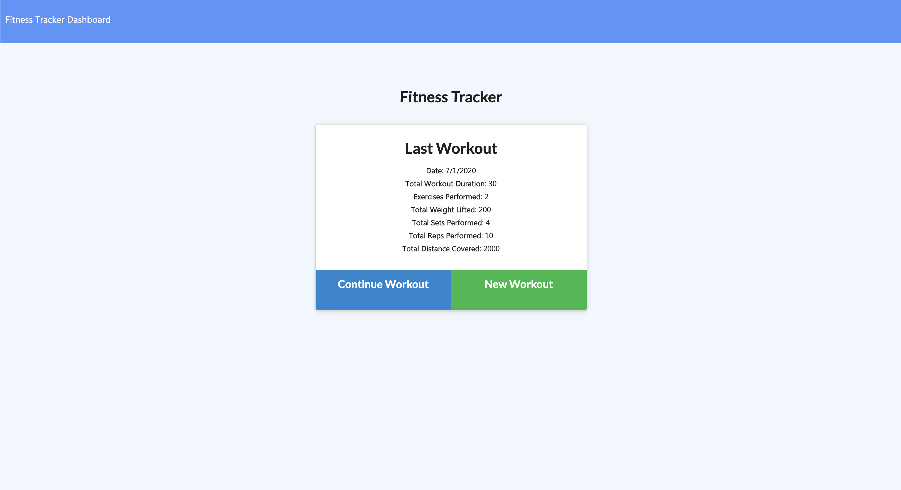

# Workout-Tracker
This application is an exercise to use MongoDB and Mongoose.

## User Story

* As a user, I want to be able to view create and track daily workouts. I want to be able to log multiple exercises in a workout on a given day. I should also be able to track the name, type, weight, sets, reps, and duration of exercise. If the exercise is a cardio exercise, I should be able to track my distance traveled.

## Link
[Fitness Tracker](https://red-doright-69001.herokuapp.com/)

## Screenshot

## License

[MIT License](LICENSE)